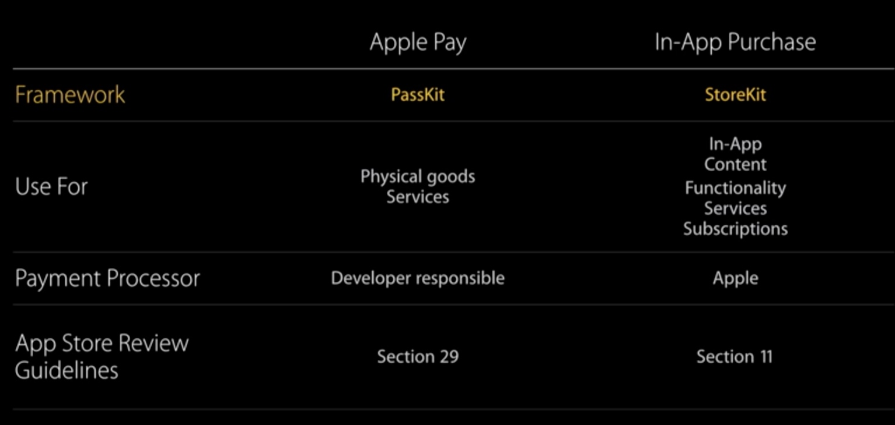
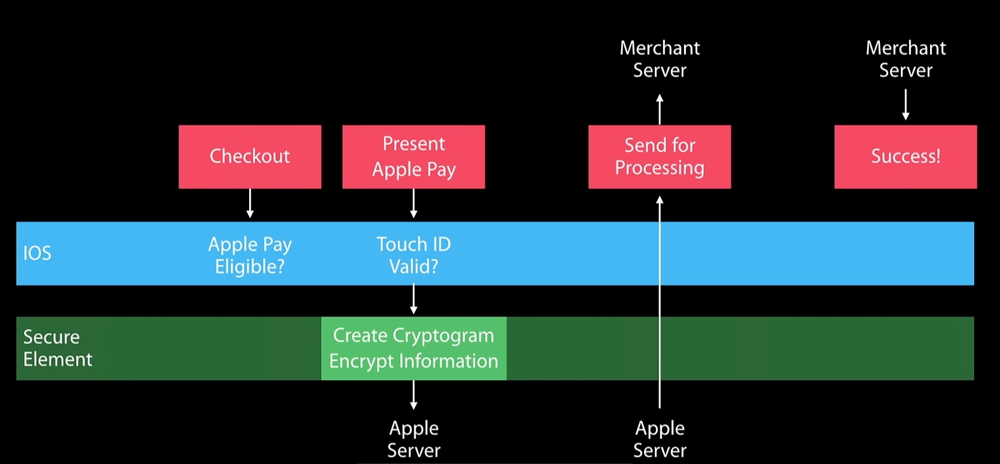
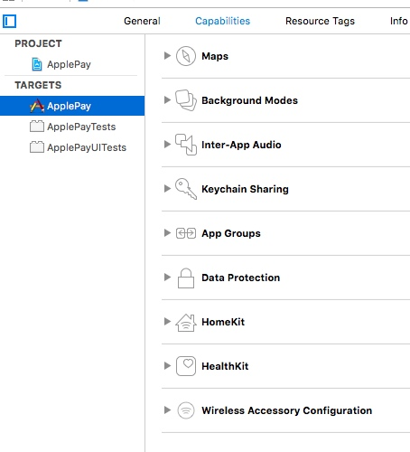

#Apple Pay

[翻译苹果官方](http://www.cocoachina.com/ios/20150126/11019.html)
[Apple-Videos](https://developer.apple.com/videos/play/wwdc2015/702/)
[Apple-Document](https://developer.apple.com/library/ios/ApplePay_Guide/)
[学习](http://www.cocoachina.com/ios/20151014/13648.html)

###Apply Pay 用在哪里

支持
Apple Pay 只能在特定的设备上使用，目前为止，这些设备包括 iPhone 6, iPhone 6+以上, iPad Air 2, iPad mini 3. 这是因为 Apple Pay 需要特定的硬件芯片来支持，这个硬件叫做 Secure Element （简称SE，安全元件）,他可以用来存储和加解密信息。
iOS 8.3 苹果支付按钮可以通过API使用

##步骤
1. 创建一个商家识别符(唯一能识别你商家身份的东西)
2. 调用支付表(苹果提供: 包括应用和支付的所有费用)
3. 用户 3D Touch 授权
4. 应用将会收到一条支付口令(支付信息,被加密的), 用它显示成功支付的清单

---
处理支付方式
1. 平台支付 3DS
2. 自己处理支付 EMV

没有Apple Pay, 支付想法可能是短暂的(想到就买, -.-)
第一次购买的应用
1. 注册登陆 -> 账单信息(收货地址)	 -> 付款(支付方式)
2. 不需要注册登陆 -> 选择Apple Pay(里面有收货地址等信息) -> 3D Touch -> 可以自定义支付信息(减少不必要的信息, 减少用户思考时间)

##代码
1. PKPaymentSummaryItem : 描述账单, 税收, 配送, 总额, etc.
2. PKPaymentRequest :
3. PKPaymentAuthorizationViewController : 付款单类, Present
4. PKPayment : 支付完成后, 包含付款信息, 展示确认单或设备回执

---
1. 检查设备是否支付Apple Pay, 是否有可用的卡
`PKPaymentAuthorizationViewController.canMakePaymentsUsingNetworks`
2. PKPaymentRequest

