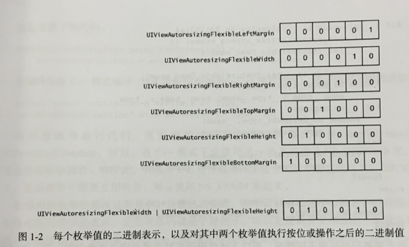
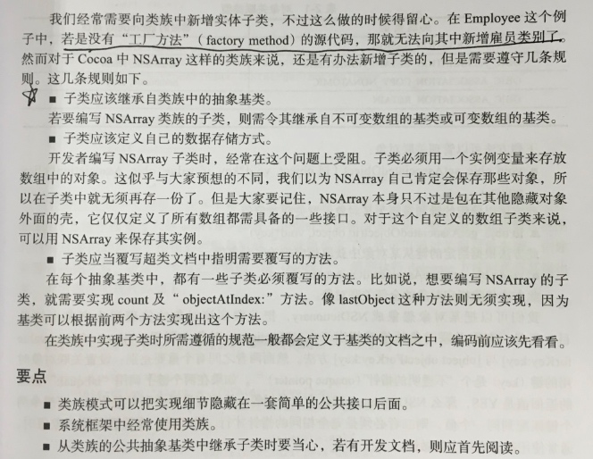
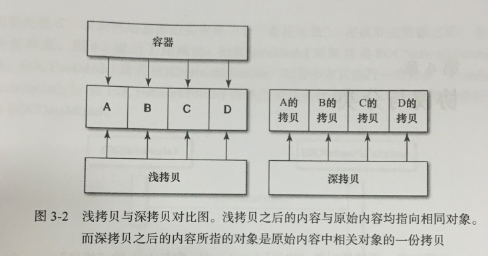

# Effective Objective-C 2.0 编写高质量iOS与OS X代码的52个有效方法


##熟悉
```
OC 为 C 的超集, 运行时判断对象类型, 判断执行哪个方法
消息语言: 运行时所应执行的代码由运行环境来决定
函数调用: 由编译器决定
框架: 将一系列代码封装为动态库, 并在其中放入描述其接口的头文件, 这样做出来的东西叫做框架. 第三方框架为静态库(不算真正的框架), 系统框架为动态库
运行期组件: 一种与开发者所编代码相链接的"动态库", 其代码能把开发者编写的粘合起来. 这样的话, 只需更新运行期组件, 即可提升应用程序性能.

指针是在栈上, 对象(alloc, new, copy, mutableCopy, retain, @property )是在堆上
```

###class-continuation
```
@class 向前声明(forward declaring), 防止头文件相互引用, 减少编译时间
.h最好用@class, 如果实在是需要#import(协议), 那就写在.m文件的class-continuation分类(extension), 定义方法和属性(一般分类只能加方法, Runtime除外)
为什么可以在class-continuation里定义实例变量, ABI机制(Application Binary Interface, 应用程序二进制接口), 类的使用者不一定需要知道实例变量的内存, 所以, 它们也就未必非得定义在公共接口中了.
```
```
如果需要引用 C++ 的文件, 写在class-continuation 也可以(WebKit, CoreAnimation里面大部分代码都是C++, 但是对外公布的是一套OC接口)
```
```
将Public 接口中声明为 "只读" 的属性扩展为 "可读写", 以便在类的内部设置其值. 如果观赛者正读取属性值而内部代码又在写和该属性时, 有可能引发"竞争条件", 合理使用同步机制.
class-continuation里的方法为私有方法, 一般会加前缀, 如 `-(void)p_method{}`
```

===
###static extern  常量, 宏, 变量 
[简书](http://www.jianshu.com/p/f83335e036b5)

1. 宏：只是在预处理器里进行文本替换，***没有类型，不做任何类型检查***，编译器可以对相同的字符串进行优化。只保存一份到 .rodata 段。甚至有相同后缀的字符串也可以优化，你可以用GCC 编译测试，***"Hello world" 与 "world" 两个字符串，只存储前面一个****。取的时候只需要给前面和中间的地址，如果是整形、浮点型会有多份拷贝，但这些数写在指令中。占的只是代码段而已，大量用宏会导致二进制文件变大. 重新定义常量值, 也不会有警告, 造成应用程序中的常量值不一致.
2. 变量：共享一块内存空间，就算项目中N处用到，也不会分配N块内存空间，可以被修改，在编译阶段会***执行类型检查***
3. 常量：共享一块内存空间，就算项目中N处用到，也不会分配N块内存空间，可以根据const修饰的位置设定能否修改，在编译阶段会***执行类型检查***


```
static const NSTimeInterval kAnimationDuration = 0.3;

static: 意味着该变量仅在定义此变量的编译单元(通常指类的.m实现文件)中可见, 编译器每收到一个编译单元, 就会输出一份"目标文件".
```


```
.h 声明
extern NSString *const Constant;
.m 定义
NSString *const Constant = @"value";
		(const 右边算一个整体不能修改)
```

===
###枚举
只是一种常量命名方式, 由C引进, 强类型(strong type), 可向前声明枚举变量(指明用何种"底层数据类型"来保存枚举类型的变量), 可向后兼容(判断编译器支持标准, 使用新旧语法)
`处理枚举类型的Switch语句中不要实现default分支`

```
typedef enum : NSUInteger {
    MyEnumValueA,
    MyEnumValueB,
    MyEnumValueC,
} MyEnum;

```

```
选项之间可以彼此组合
enum UIViewAutoresizing {
    UIViewAutoresizingNone                 = 0,
    UIViewAutoresizingFlexibleLeftMargin   = 1 << 0,
    UIViewAutoresizingFlexibleWidth        = 1 << 1,
    UIViewAutoresizingFlexibleRightMargin  = 1 << 2,
    UIViewAutoresizingFlexibleTopMargin    = 1 << 3,
    UIViewAutoresizingFlexibleHeight       = 1 << 4,
    UIViewAutoresizingFlexibleBottomMargin = 1 << 5
};

NS_OPTIONS(兼容C++模式编译, 类型转换) 
需要以按位或操作来组合的枚举时使用 NS_OPTIONS, 其它使用 NS_ENUM 来定义 
typedef NS_OPTIONS(NSUInteger, UIViewAutoresizing) {
    UIViewAutoresizingNone                 = 0,
    UIViewAutoresizingFlexibleLeftMargin   = 1 << 0,
    UIViewAutoresizingFlexibleWidth        = 1 << 1,
    UIViewAutoresizingFlexibleRightMargin  = 1 << 2,
    UIViewAutoresizingFlexibleTopMargin    = 1 << 3,
    UIViewAutoresizingFlexibleHeight       = 1 << 4,
    UIViewAutoresizingFlexibleBottomMargin = 1 << 5
};
```




===
##对象, 消息, 运行时
`1. 用Objective-C等面向对象语言编程时, "对象(object)"就是"基本构造单元(building block)", 开发者可以通过对象来存储并传递数据. 在对象之间传递数据并执行任务的过程就叫做"消息传递(Messaging)". 
2. 当应用程序运行起来以后, 为其提供想着支持的代码叫做"Objective-C运行期环境(Objective-C runtime)", 它提供了一些使得对象之间能够传递消息的重要函数, 并且包含创建类实例所用的全部逻辑.`

```
所有{}都是成员变量, OC的指针对象可以叫实例变量

@protected 
	默认, 类内部和子类可以访问(可继承)
@private
	只有类内部可以访问
@public
	外部可以访问, 只要是类对象就可以访问	
	
@property
copy
当NSString *类型时, 用copy 特质来保护其封装性, 因为传递给设置方法的新值有可能指向一个NSMutableString 类的实例. 此时若是不拷贝字符串, 那么设置完属性之后, 字符串的值就可能会在对象不矫情的情况下遭人更改. 这时就要拷贝一份"不可变"的字符串, 确保对象中的字符串值 不会无意间变动. 只要实现属性所用的对象是"可变的", 就应该在设置新属性值时拷贝.

类对象构造机时, 如果属性特质为copy那么初始化时也要一样 _name = [name copy]; init里不能调用存取方法

iOS 就算设置成 atomic 属性, 也不能保证是"线程安全", 还需采用更为深层的锁定机制才行, 但是还是很影响性能. 而Mac OS 设置 atomic 属性通常都不会有性能瓶颈.
```
```
    NSMutableString *str = [[NSMutableString alloc] initWithString:@"aa"];
    p.strongProperty     = str;
    p.copyProperty       = str;
    [str appendString:@"123"];
strongProperty : aa123
copyProperty   : aa

Tips: 
NSString *str = @"123";
%p-str : 打印的是str变量的地址里的内容(@"123"的内容地址)
%p-&str: 打印的是str变量的地址 
	NSMutableString 指向的地址, 内容变了, 地址还是同一个
	NSString 内容变了, 地址也变了

```

===
###对象内部访问实例变量
直接访问实例变量:
1. 速度快(不经过方法派发), 编译器所生成的代码会直接访问保存对象实例变量的那块内存.
2. 不会调用其"设置方法", 绕过了属性定义的"内存管理语义", ARC下copy只会保留新值并释放旧值
3. 不会触发"键值观测(KVO)"通知.
属性访问: 有助于排查与这想着的错误, 存取方法中可以增加"断点".

`写入实例变量时, 通过其"设置方法"(确保内存管理语义), 读取实例变量时, 则直接访问`
1. 懒加载, 必须用属性访问, 否则实例变量永远不会初始化.
2. 初始化方法及 dealloc 方法中, 总是应该直接通过实例变量来读写数据.
		初始化设置方法, 属性访问会死循环
3. 在对象内部读取数据时 ,应用直接通过实例变量来读, 而写入数据时, 则应通过属性来写.

===
###对象等同性(什么时候要用?)
== : 比较指针本身
isEqual : 等同性, 指针所存的内存地址
isEqualToString : 还要判断类型

```
- (BOOL)isEqual:(id)object;
@property (readonly) NSUInteger hash;

当且仅当其 "指针值" 完全相等时, 这两个对象才相等. 
如果 "isEqual:" 方法判定两个对象相等, 那么其 hash 方法了必须返回同一个值.
但是, 如果两个对象的 hash 方法返回同一个值, 那么 "isEqual:" 方法未必会认为两者相等.
```

```
override

- (BOOL)isEqual:(id)object
{
    if ([self class] == [object class]) // 同一个类, 考虑继承
        return [self isEqualToPerson:(Person *)object];
    else
        return [super isEqual:object];
}

- (BOOL)isEqualToPerson:(Person *)otherPerson
{
    if ( self == otherPerson ) return YES;   // 指针是否相同

    // 检测每个属性是否相等
    if (![_name isEqual:otherPerson.name]) return NO;
    if (_age != otherPerson.age ) return NO;

    return YES;
}

// 高效率且碰撞(collision)机率比较低
- (NSUInteger)hash  
{
    NSUInteger nameHash = [_name hash];
    NSUInteger ageHash  = _age;

    return nameHash ^ ageHash;
}

// 返回单一值: return 1024, 有性能问题
- (NSUInteger)hash  
{
   return 1024;
}

// 还要负担创建字符串的开销, 比返回单一值慢, 会产生性能问题, 想添加, 必须先计算哈希码
- (NSUInteger)hash
{   
    NSString *stringToHash = [NSString stringWithFormat:@"%@:%i",_name, _age];
    return [stringToHash hash];
}
```
不要把可变的放入collection
`NSSet(或NSMutableSet) 里放两个可变数组[1],[1,2], 之后在[1]里加2, NSSet会放入两个一样的数组, 再[set copy]后还是两个一样数组(set为不可变时copy), [set mutableCopy]后就只剩一个数组了`

===
###"类族"隐藏实现细节
也叫"类簇"是一种很有用的模式(pattern), 可以隐藏"抽象基类"背后的实现细节. `+ (instancetype)buttonWithType:(UIButtonType)buttonType;`
返回的对象类型取决于传入的***按钮类型***, 然而不管返回的是什么类型, 它们都继承于同一个基类: UIButton. 用户无须关心创建出来的按钮具体属于哪个子类, 利于封装. 大部分collection都是类族, 如MSArray, MSMutableArray

**[self, super 解释](http://www.cnblogs.com/tangbinblog/p/4034890.html)**

```
创建类族
+ (Employee *)initWithEmployeeType:(EmployeeType)type
{
    switch (type) {
        case EmployeeTypeDeveloper: {
            return [EmployeeDeveloper new];
            break;
        }
        case EmployeeTypeDesigner: {
            return [EmployeeDesigner new];
            break;
        }
    }
}

+ (void)work; // 子类实现, 堆上的对象是谁, 调用的就是谁的方法, [super class]也等于那个子类, super 只是一个"编译器指示符". superClass是父类.
```

**为类族新增新的子类**+



##消息转发
###[Runtime理论](https://www.ianisme.com/ios/2019.html)
###[GitHub实践](https://github.com/yfGit/2016-day-by-day/tree/master/Runtime)
```
"在运行期检视对象类型" 叫做 "类型信息查询"(introspection,"内省")
在程序中不要直接比较对象所属的类型, 明智的做法是调用"类型信息查询", 因为有些对象可能实现了消息转发机制.
```
```
通过 isa 指针获取对象所属的类(实例和类的isa不一样), 通过 super_class 指针在继承体系中游走

// 判断对象是否为某类或其派生类的实例(某类或其子类)
- (BOOL)isKindOfClass:(Class)aClass;

// 判断对象是否为某个特定类的实例
- (BOOL)isMemberOfClass:(Class)aClass;

NSMutableArray *array = [NSMutableArray new];
类簇的原因  
NSMutableArray   __NSArrayM  
NSArray 		 __NSArrayI

[array isKindOfClass:[NSArray class]];          // YES
[array isKindOfClass:[NSMutableArray class]];   // YES
[array isMemberOfClass:[NSArray class]];        // NO
[array isMemberOfClass:[NSMutableArray class]]; // NO 
[array isMemberOfClass:NSClassFromString(@"__NSArrayM")] // YES

另一种判断是否为某类实例的方法, 不能用 isEqual: 因为类对象是"单例",
[array class] == [NSMutableArray class]  // NO

代理对象调用 class 方法, 返回的是代理对象本身(此类是 NSProxy 的子类), calss 方法所返回的类表示发起代理的对象, 而非接受代理的对象.
但是改用 "isKindOfClass:" 代理对象会把消息转给 "接受代理的对象"
```

##接口与API设计
`Objective-C 没有命名空间 `

类名 : 容易造成命名冲突, Apple 保留使用所有 "两字母前缀" 的权利, 
分类, 方法: 类的实现文件中所用的**纯C函数及全局变量**, 在编译好的目标文件中(编译器每收到一个编译单元(.m), 就会输出一份"目标文件"), 这些名称是要算作**"顶级符号"**的

全能初始化方法: 其他初始化方法都会调用它, 只有在它里面才实现存储内部数据, 利于修改.
如果子类的全能初始化方法与超类方法的名称不同, 那么总应覆写超类的全能初始化方法.

##错误模型
```
NSException : NSObject 抛出异常会直接导致应用程序退出, 只使用在测试或致命的错误(创建抽象类)
```

```
NSError 把错误的原因回报给调用者
@property (readonly, copy) NSString *domain; // 错误范围
@property (readonly) NSInteger code; // 错误码
@property (readonly, copy) NSDictionary *userInfo; // 用户信息
+ (instancetype)errorWithDomain:(NSString *)domain code:(NSInteger)code userInfo:(nullable NSDictionary *)dict;
```

1. 代理

```
- (void)connection:(NSURLConnection *)connection didFailWithError:(NSError *)error;
```

2. 经由方法的 "输出参数" 返回给调用者

```
一般会自己指定一个专用的 "错误范围" 字符串, 错误码定义成枚举

    NSError *error = nil;
    BOOL isSet = [self doSomething:&error]; // 用户可以直接写nil
    if XXX

- (BOOL)doSomething:(NSError **)error
{
    // cause an error
    if (error) {  //  需要判断, 因为用户传 nil
        *error = [NSError errorWithDomain:@"123" code:2 userInfo:@{@"a":@"1"}]; 
    }
}
*error语法 为 error参数 "解引用", error 所指的那个指针现在要指向一个新的NSError对象, 如果error 为nil, 空指针解引用会导致"段错误"并使应用程序崩溃
```

##NSCopying 协议
`[NSMutableArray copy] ==> NSArray;
[NSArray mutableCopy] ==> NSMutableArray;`

`一般方法返回collection用到的是属性, 用[property copy], 防止可变集合`

```
@protocol NSCopying
- (id)copyWithZone:(nullable NSZone *)zone;

@protocol NSMutableCopying
- (id)mutableCopyWithZone:(nullable NSZone *)zone;
```


```
- (id)copyWithZone:(NSZone *)zone
{
    Employee *employee = [[[self class] allocWithZone:zone]
                          initWithName:_name
                          salary:_salary];
    return employee;
}
```

**深浅拷贝**


Foundation框架中的所有collection类在默认情况下都执行浅拷贝, 只拷贝容器对象本身, 而不复制其中的数据. 因为容器里的对象未必都能拷贝, 调用者也未必想拷贝.

```
深拷贝没有专门定义的协议, 需要每个类自己来确定
- (id)deepCopy
{
	Employee *employee = [[[self class] allocWithZone:zone]
                          initWithName:_name
                          salary:_salary];
	employee.array = [[NSMutableArray alloc] initWithSet:_array copyItems:YES];
} 
- (id)initWithSet:(NSArray *)array copyItems:(BOOL)copyItems;
```

##协议与分类
`协议: OC特性, 不支持多继承, 所有用协议扩展某个类应该实现的一系列方法, 协议能很好地描述接口. 委托模式`
`分类: 利用分类机制, 无须继承子类 即可直接为当前类添加属性,方法`
	
```
if ([delegate respondsToSelector:@selector(doSomething:)]) {
	[delegate doSomething:nil];
}
除了第一次检测的结果有用之外, 后续的检测可能都是多余的. 通常把委托对象能否响应某个协议方法这一信息缓存起来, 以优化程序效率.
把方法响应能力缓存起来的最佳途径是使用 "位段" 数据类型. 可以把结构体中某个字段所占用的二进制位个数设为特定的值.

利用结构体来保存
typedef struct {
    unsigned int didReceiveData   : 1;
    unsigned int didFailWithError : 1;
    unsigned int doSomething      : 1;
}Flag;
```
```
利用分类来给类归入不同的"功能区"
1. 便于调试, 回溯信息 [NSURLRequest(NSHTTPURLRequest) HTTPMethod] 
2. 如ftp 不用设置 "HTTP方法"(NSHTTPURLRequest)
如: NSURLRequest (NSHTTPURLRequest) 
```

`有时对象的类型并不重要, 重要的是对象有没有实现某些方法 🔽`

```
通过协议提供匿名对象
1. 协议只提供公共方法
2. 类方法返回 id<Protocol> 
3. 当返回的类型不定, 或种类多时, 只要切换就可以了, 不用更换API
```
	

#内存管理
`引用计数原理: 
  对象(基本数据类型不需要)有个计数器, 用以表示当前有多少个事件想令此对象继续存活下去. retain, release, autorelease`
  
```  
__strong: 保留此值
__unsafe_unretained: 不保留此值, 这么做可能不安全(和weak不一样, 不会置nil), 因为等到再次使用变量时, 其对象可能已经回收了
__weak: 不保留此值, 但是变量可能安全使用, 因为如果系统把这个对象回收了, 那么变量也会自动清空(nil)
__autoreleasing: 把对象"按引用传递"给方法时, 使用这个特殊的修饰符, 此值在方法返回时自动释放
```

内存分类, 可重用
`@autoreleasepool {} 降低内存峰值, 左花括号处创建, 右花括号处自动清空, for循环`

```
僵尸对象: 内存已被回收的对象
向僵尸对象发送消息, 崩溃与否, 取决于对象所占内存有没有为其他内容所覆写. 没有崩溃, 可能只复用了其中一部分, 某些二进制依然有效; 或者那块内存恰好为另外一个有效且存活的对象所占据, 新对象无法响应选择子, 依然崩溃.
启用"僵尸对象", 如果对象是僵尸对象(release为0,释放后), 会把类名转换为 _NSZombie_ObjectClass, 系统会个性对象的isa指针, 令其指向特殊的僵尸类, 从而使对象变为僵尸对象, 僵尸类响应所有选择子, 打印一条包含消息内容及其接怀者的消息, 然后终止应用程序. 
___forwarding___消息转发判断是否有前缀_NSZombie_

*** -[ObjectClass msg]: message sent to deallocated instance 0*1f12a3fde3425 
```
```
NSString *str   = @"Some thing";
NSNumber *num   = @10;
NSNumber *num2  = @3.14f;

str    retainCount  2^64-1   
num    retainCount  2^63-1
num2   retainCount  1

单例对象其保留计数绝对不会变, 这种对象的保留及释放操作都是"空操作"
NSSting,NSNumber都是"单例对象"
如果是编译期常量, 编译器会把NSString对象所表示的数据放在应用程序的二进制文件里, 运行程序时就可以直接用了, 无须再创建NSString对象. 
NSNumber类似, 使用了"标签指针"的概念来标特定类型的数值, 这种做法不使用NSNumber对象, 而是把与数值有关的全部消息都放在指针值里面. 浮点数没有优化
```

#块与大中枢派发

###块
定义"块"的范围内, 可以访问到其中的全部变量
块与函数类似, 只不过是直接定义在另一个函数里, 和定义它的那个函数共享同一个范围内的东西
__block 修饰符, 可以修改块捕获的变量的值, 它总能访问实例变量
块所捕获的变量是对象类型, 会自动保留它, 块本身也是对象
定义块时, 分配在栈中, 要copy 到堆; 

```
全局块相当于单例, 不会捕获任何东西
int (^block)(int,int) = ^(int a, int b){
    return  a+b;
};
```

###GCD
`执行异步派发时, 需要拷贝块`
`并行是CPU的多核芯同时执行多个任务, 并发是单核CPU交替执行两个任务`

```
队列的特点：先进先出，排在前面的任务最先执行，

串行队列：任务按照顺序被调度，前一个任务不执行完毕，队列不会调度

并行队列：只要有空闲的线程，队列就会调度当前任务，交给线程去执行，不需要考虑前面是都有任务在执行，只要有线程可以利用，队列就会调度任务。

主队列：专门用来在主线程调度任务的队列，所以主队列的任务都要在主线程来执行，主队列会随着程序的启动一起创建，我们只需get即可

全局队列：是系统为了方便程序员开发提供的，其工作表现与并发队列一致，那么全局队列跟并发队列的区别是什么呢？

1.全局队列：无论ARC还是MRC都不需要考录释放，因为系统提供的我们只需要get就可以了

2.并发队列：再MRC下，并发队列创建出来后，需要手动释放dispatch_release()

同步执行：不会开启新的线程，任务按顺序执行

异步执行：会开启新的线程，任务可以并发的执行
```

```
1. 串行队列同步执行：综合上面阐述的串行队列的特点 --- 按顺序执行，同步：不会开启新的线程，则串行队列同步执行只是按部就班的one by one执行。

2. 串行队列异步执行：虽然队列中存放的是异步执行的任务，但是结合串行队列的特点，前一个任务不执行完毕，队列不会调度，所以串行队列异步执行也是one by one的执行

3. 并行队列同步执行：结合上面阐述的并行队列的特点，和同步执行的特点，可以明确的分析出来，虽然并行队列可以不需等待前一个任务执行完毕就可调度下一个任务，但是任务同步执行不会开启新的线程，所以任务也是one by one的执行

4. 并行队列异步执行：再上一条中说明了并行队列的特点，而异步执行是任务可以开启新的线程，所以这中组合可以实现任务的并发，再实际开发中也是经常会用到的
```

```
GCD实现原理:

GCD有一个底层线程池，这个池中存放的是一个个的线程。之所以称为“池”，很容易理解出这个“池”中的线程是可以重用的，当一段时间后这个线程没有被调用胡话，这个线程就会被销毁。注意：开多少条线程是由底层线程池决、、、、、定的（线程建议控制再3~5条），池是系统自动来维护，不需要我们程序员来维护（看到这句话是不是很开心？）

而我们程序员需要关心的是什么呢？我们只关心的是向队列中添加任务，队列调度即可。

	1.如果队列中存放的是同步任务，则任务出队后，底层线程池中会提供一条线程供这个任务执行，任务执行完毕后这条线程再回到线程池。这样队列中的任务反复调度，因为是同步的，所以当我们用currentThread打印的时候，就是同一条线程。

	2.如果队列中存放的是异步的任务，（注意异步可以开线程），当任务出队后，底层线程池会提供一个线程供任务执行，因为是异步执行，队列中的任务不需等待当前任务执行完毕就可以调度下一个任务，这时底层线程池中会再次提供一个线程供第二个任务执行，执行完毕后再回到底层线程池中。

	3.这样就对线程完成一个复用，而不需要每一个任务执行都开启新的线程，也就从而节约的系统的开销，提高了效率。在iOS7.0的时候，使用GCD系统通常只能开5~8条线程，iOS8.0以后，系统可以开启很多条线程，但是实在开发应用中，建议开启线程条数：3~5条最为合理。
```

###NSOperation
区别GCD
1. 取消某个操作
2. 指定操作间的依赖关系(如所依赖的文件下载完成后才能处理)
3. KVO 监听 isCancelled isFinished
4. 指定操作的优先级. GCD的优先级是针对整个队列来说的, 而不是针对每个块来说的.
5. 重用NSOperation对象. 符合(Don't Repeat Yourself, DRY)原则, 可以在代码中多次使用


#框架

###遍历
`for循环实现反向遍历会比其他方式简单许多`

```
NSEnumerator
    NSArray *array;
    NSEnumerator *enumerator = [array objectEnumerator];
    id object;
    while ((object = [enumerator nextObject]) != nil) {

    }

    NSDictionary *dict;
    NSEnumerator *enumerator = [dict keyEnumerator];
    id key;
    while ((key = [enumerator nextObject]) != nil) {
        id value = dict[key];
    }

    NSSet *set;
    NSEnumerator *enumerator = [set objectEnumerator];
    id obj;
    while ((obj = [enumerator nextObject]) != nil) {
        
    }
    
    // 反向遍历
    NSEnumerator *enumerator = [array reverseObjectEnumerator];
```

```
NSFastEnumerator 没有下标
    for (<#type *object#> in <#collection#>) {
        <#statements#>
    }
    
    for (id object in [array reverseObjectEnumerator]) {
        <#statements#>
    }
```

```
Block
可以修改方法签名: NSString *key, NSArray *obj
stop: 其他方法也可以用break跳出循环
    [dict enumerateKeysAndObjectsUsingBlock:^(id key, id obj, BOOL *stop) {
        if (<#condition#>) {
            *stop = YES;
        }
    }];
    
- (void)enumerateKeysAndObjectsWithOptions:(NSEnumerationOptions)opts usingBlock:(void (^)(KeyType key, ObjectType obj, BOOL *stop))block;

 typedef NS_OPTIONS(NSUInteger, NSEnumerationOptions) {
    NSEnumerationConcurrent = (1UL << 0), // 并行 GCD
    NSEnumerationReverse = (1UL << 1),    // 反向遍历
};  
  
```

###无缝桥接
```
    NSArray *array;
    CFArrayRef cfArray = (__bridge CFArrayRef)array;
    CFArrayGetCount(cfArray);
    
__bridge: ARC仍具备这个对象的所有权
__bridge_retained: 交出所有权, CFRelease(cfArray), 释放
__bridge_Transfer: CF转F, ARC获得所有权
```

###NSCache
```
1. 会自动删减(最久未使用的), 删减时机: 缓存中的对象总数 和 所有对象的"总开销"
2. 不会"拷贝"键, 而是会"保留"键, 因为有些键是不支持拷贝的
3. 线程安全
4. 配合NSPurgeableData
```

###load initialize
```
+ (void)load: 每个类都必定执行完成前程序阻塞. 先调类, 再调分类. 因为无法判断出各个类的载入顺序, 在load方法里使用其它类是不安全的

+ (void)initialize: 只有使用到的时候才执行. 只调用一次. 可以安全使用其他类
  如果超类写了, 子类没有写, 会先调超类的, 然后子类的也会在超类里执行一次
```


