# HTTP
```
HTTP: HyperText Transfer Protocol (超文本转移协议) - 文档传递协议
WWW : World Wide Web (万维网) - 致力于全世界的研究者们进行知识共享
HTML: HyperText Markup Language (超文本标记语言) - 页面的文本标记
URL : Uniform Resource Locator (统一资源定位符) - 指定文档所在地址
SSL : Secure Sockets Layer (安全套接层)
TLS : Transport Layer Security (传输层安全)

TCP/IP : 协议簇, 互联网想着的各类协议簇的总称, HTTP属于它内部的一个子集
   协议 : 不同的硬件, 操作系统之间的通信, 所有的一切都需要一种规则
应用层 : 决定了向用户提供应用服务时通信的活动, HTTP也处于该层.
		TCP/IP内预存了各类通用的应用服务. FTP(File Transfer Protocol,文件传输协议), DNS(Domain Name System,域名系统)服务等
传输层 : 对上层应用层, 提供处于网络连接中的两台计算机之间的数据传输. 
	    协议 : TCP(Transmission Control Protocol,传输控制协议), UDP(User Data Protocol,用户数据包协议).
网络层 :(网络互连层) 处理在网络上流动的数据包. 数据包是网络传输的最小数据单位. 
		该层规定了通过怎样的路径(传输路线)到达对方计算机, 并把数据包传送给对方. 与对方计算机之间通过钓鱼台计算机或网络设备进行传输时, 网络层所起的作用就是在众多的选项内选择一条传输路线.
数据链路层 : 处理连接网络的硬件(操作系统.硬件的设备驱动.网络适配器.网卡.传输媒介)等物理可见设备
```
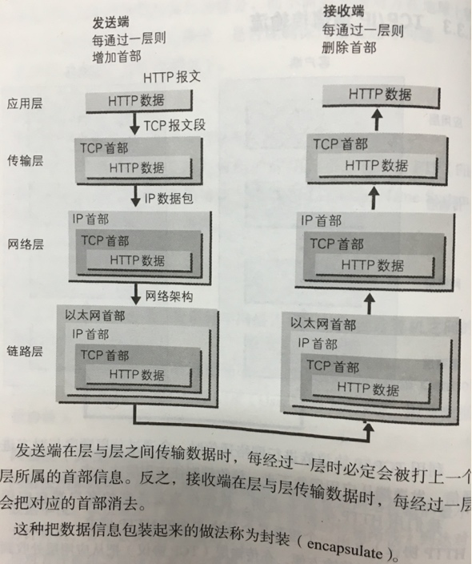


```
发送端从应用层往下走, 接收端往应用层上走.
封装: 发送端, 每经过一层必定被打上一个该层所属的首部信息, 接收端在层与层之间传输数据时, 每经过一层时会把对应的首部消去.

IP: (Internet Protocol)网际协议, 把各种数据包传送给对方
ARP: (Address Resolution Protocol) 解析地址的协议, 根据通信方的IP地址就能反向查出对应的MAC地址
TCP: 传输层, 提供可靠的字节流服务. 字节流服务: 为了方便传输, 将大块数据分割成以报文段为单位的数据包进行管理. 可靠: 能够把数据准确可靠地传给对方, 能够确认数据最终是否送达到对方(三次握手)
DNS: (Domain Name System)应用层, 提供域名到IP地址之间的解析服务
```

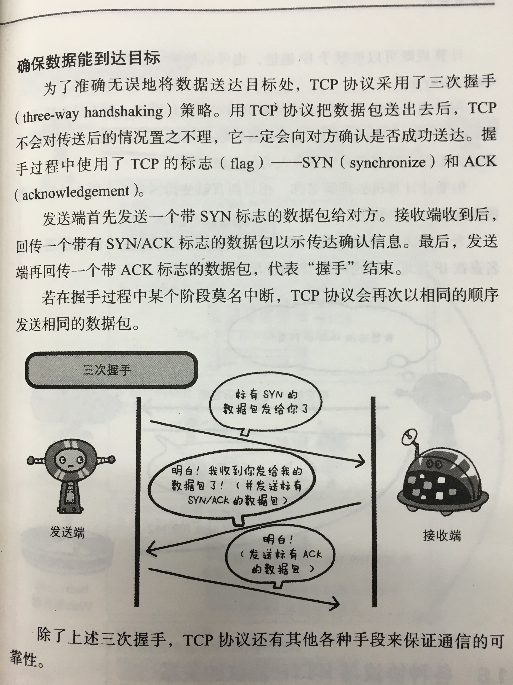


###URL, URI

```
URL: (Uniform Resource Locator,统一资源定位符)标识某一互联网资源, URI的子集,  www.baidu.com
URI: (Uniform Resource Identifier,统一资源标识符)表示资源的地点,  http:, https:, ftp:, mailto, telnet, file  等30种左右
网址: IPV4(192.168.1.1) IPV6([0:0:0:0:0:0:0:1])
```

##HTTP协议用于客户端和服务器端之间的通信

1. 应用HTTP协议时, 必定是一端担任客户端角色, 另一端担任服务器端角色
2. HTTP协议自身不具备保存之前发送过的请求或响应的功能(无状态协议, 不做持久化处理,不知道之前发送了什么, 为了更快地处理大量事务, 确保梦回鹿鼎记的可伸缩性)
3. HTTP/1.1 无状态, 引入了Cookie技术
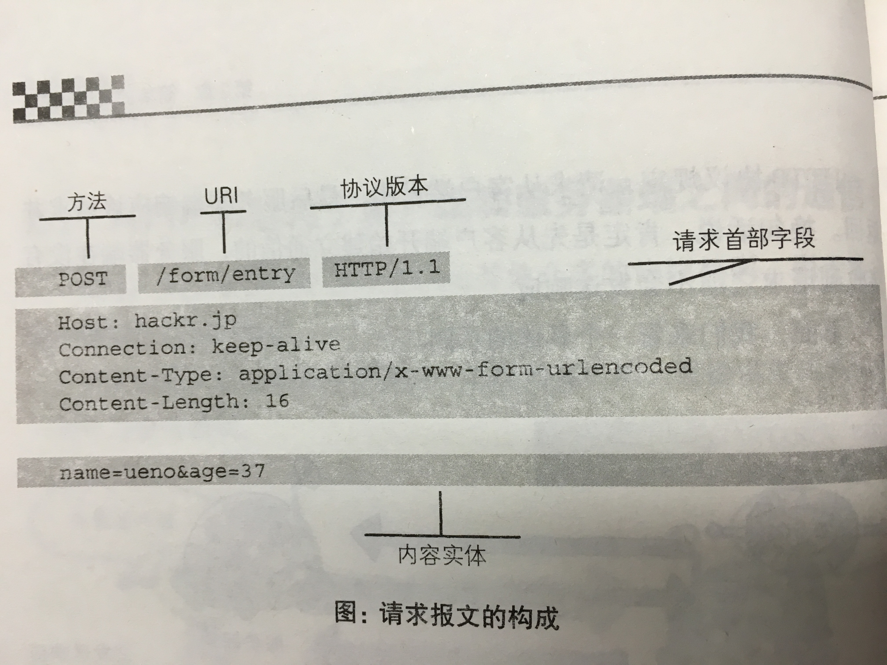
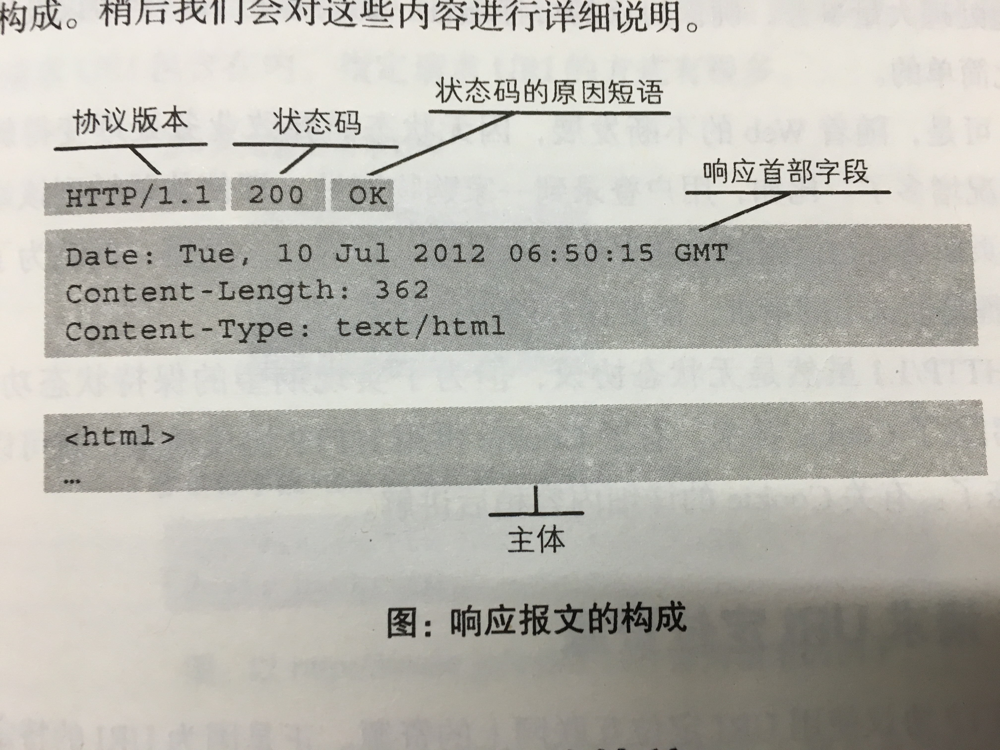

###请求方法
1. GET: 获取资源
2. PUST: 传输实体主体
3. PUT: 传输文件, HTTP/1.1 PUT自身不带验证机制
4. HEAD: 获得报文首部, 和GET方法一样, 只是不返回报文文体部分, 用于确认URI的有效性及资源更新的日期时间等
5. DELETE: 删除文件, HTTP/1.1 DELETE自身不带验证机制
6. OPTIONS: 询问支持的方法(GET,POST...)
7. TRACE: 追踪路径, Max-Forwards首部字段中填入数值, 每经过一个服务器端就减1, 0时最后的服务器端返回200 OK, 查询请求是怎样被加工修改/篡改的, 容易引发XST(Cross-Site Tracing,跨站追踪)攻击
8. CONNECT: 要求用隧道协议连接代理, 要求在与代理服务器通信时建立隧道, 实现用隧道协议进行TCP通信, 使用SSL,TLS协议把通信内容加密后经网络隧道传输 

##持久连接节省通信量
HTTP/1.1 所有的连接默认都是持久连接, 客户端和服务器端都需要支持持久连接
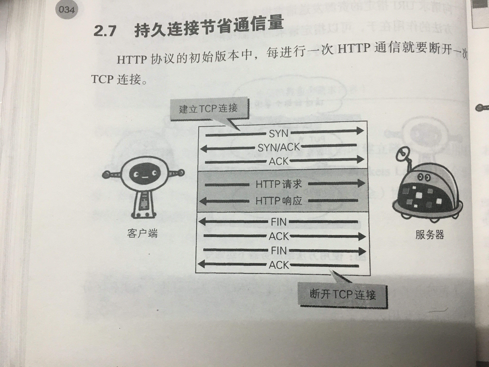

管线化: 不用等待响应可直接发送下一个请求(一次TCP连接,可以多个请求且并行发送)

#HTTP报文
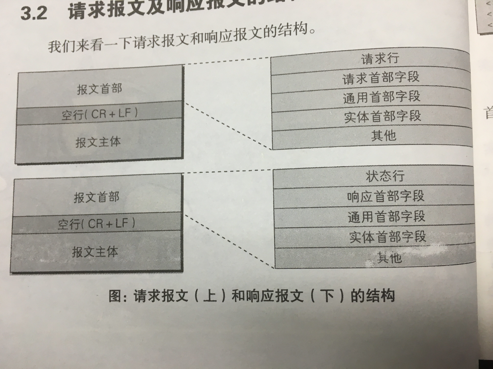


首部字段分4种: 通用首部, 请求首部, 响应首部, 实体首部

###编码提升传输速率

	HTTP在传输数据时可以按照数据原貌直接传输, 也可以在传输过程中通过编码提升传输速率, 能有效地处理大量的访问请求. 但是, 编码的操作需要计算机来完成, 因此会消耗更多的CPU等资源.
	通常, 报文主体等于实体主体. 只有当传输中进行编码操作时, 实体主体的内容发生变化, 才导致它和报文主体产生差异
	
1.	压缩传输的常用的内容编码
	- gzip (GNU zip)
	- compress (UNIX 系统的标准压缩)
	- deflate (zlib)
	- identity (不进行编码)	
2. 分割发送的分块传输编码 `将实体主体分成多个部分, 由接收的客户端解码`
3. 发送多种数据的多部分对象集合 `需要在首部字段里加上 Content-type`
  - `multipart/form-data`  在Web表单文件上传时使用
  - `multipart/byteranges` 状态码206(Partial Content,部分内容)响应报文包含多个范围的内容时使用
4. 获取部分内容的范围请求(断点续传)`能从之前下载中断处恢复下载`
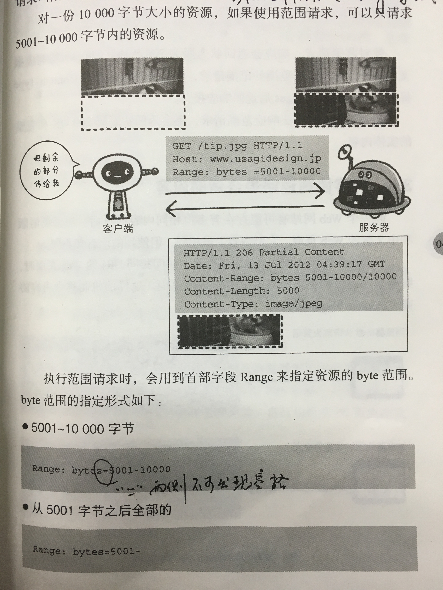

 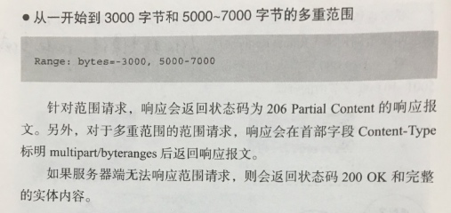

5. 内容协商返回最合适的内容
	浏览器默认语言为英语或中文, 访问相同URI的Web页面时, 则会显示对应的英语版或中文版的Web页面
	**服务器驱动协商 - 客户端驱动协商 - 透明协商**
	机制: 客户端和服务器端就响应的资源内容进行交涉, 然后提供给客户端最为适合的资源. 内容协商会以响应资源的语言,字符集,编码方式等作为判断的基准.
	- Accept
	- Accept-Charset
	- Accept-Encoding
	- Accept-Language
	- Connect-Language

#HTTP状态码
`负责表示客户端HTTP请求的返回结果, 票房服务器端的处理是否正常,通知出现的错误等工作`

##2XX 成功
请求被正常处理了.

### 200 OK 
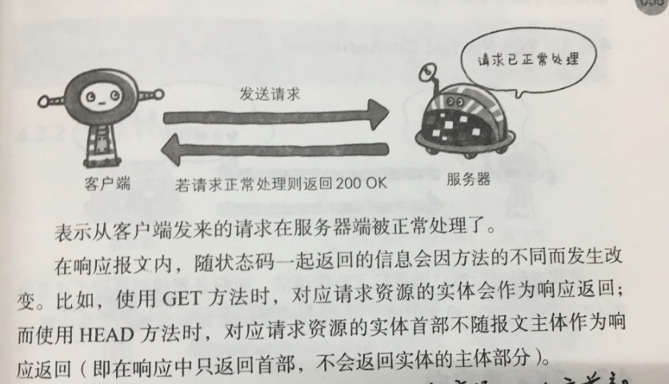

###204 No Content
		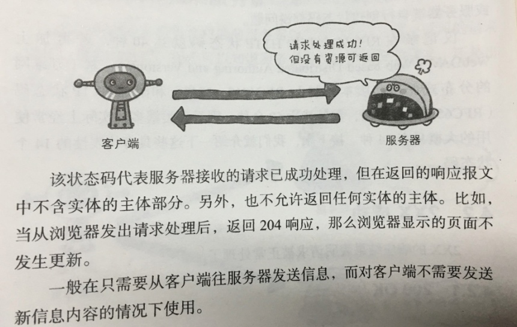

###206 Partial Content 
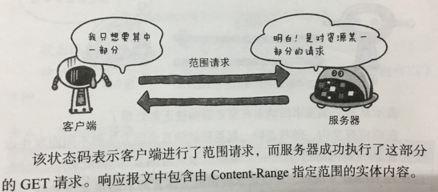


##3XX 重定向
表明浏览器需要执行某些特殊的处理以正确处理请求.

### 301 Moved Permanently 

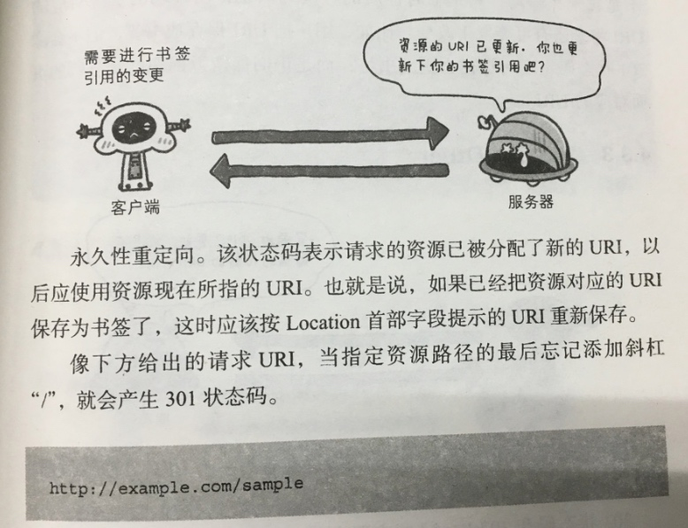

###302 Found
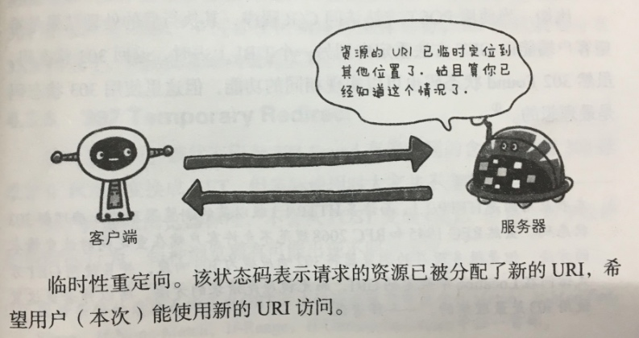
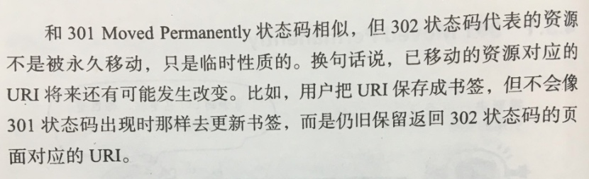

###303 See Other 
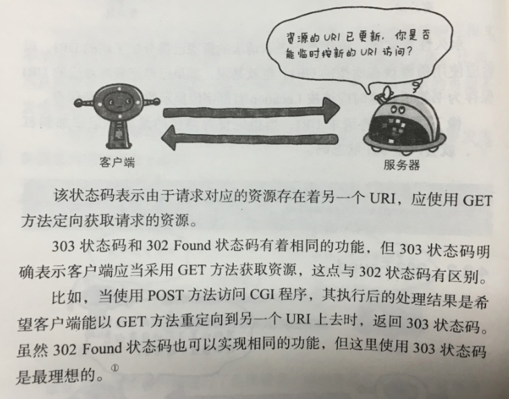


###304 Not Modified ``
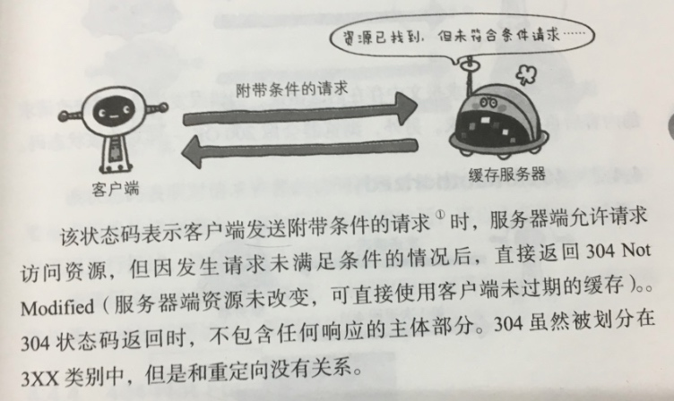
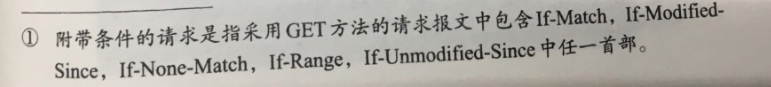

### 307 Temporary Redirect
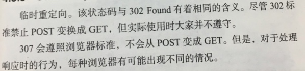


##4XX 客户端错误
###400 Bad Request
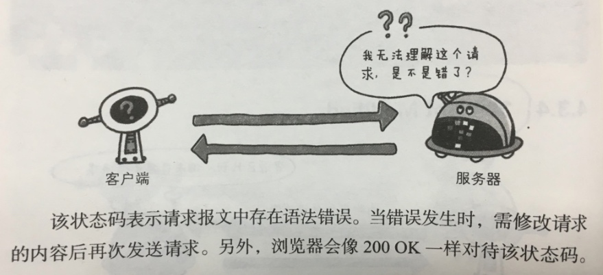
### 401 Unauthorized
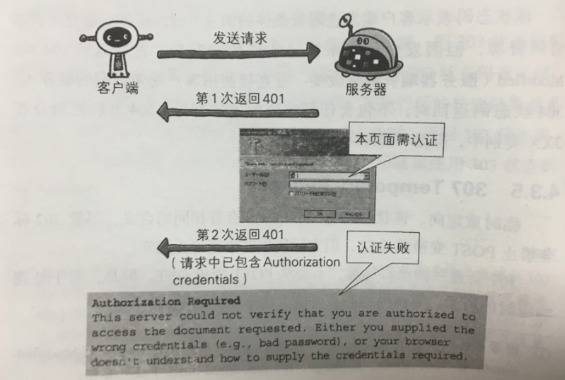
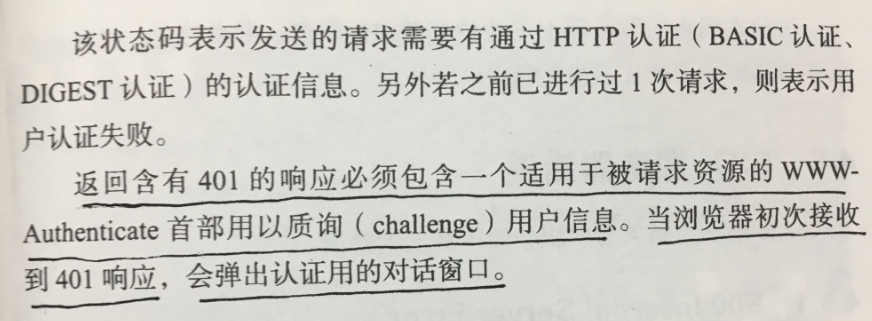

### 403 Forbidden
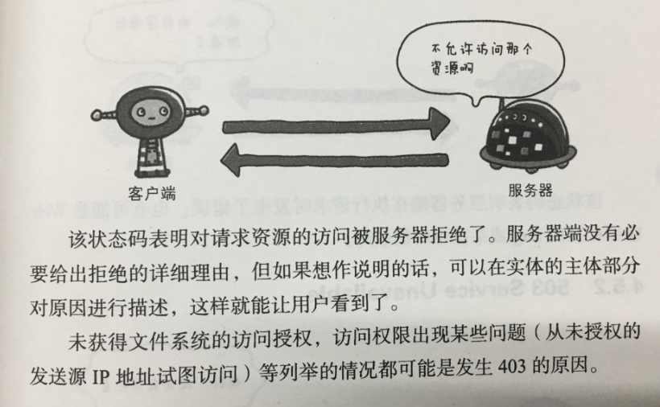

### 404 Not Found
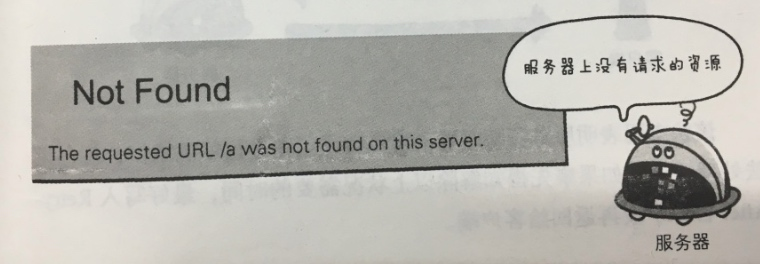
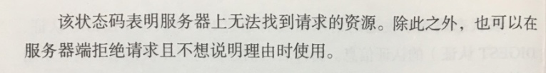

##5XXX 服务器错误
###400 Internal Server Error 
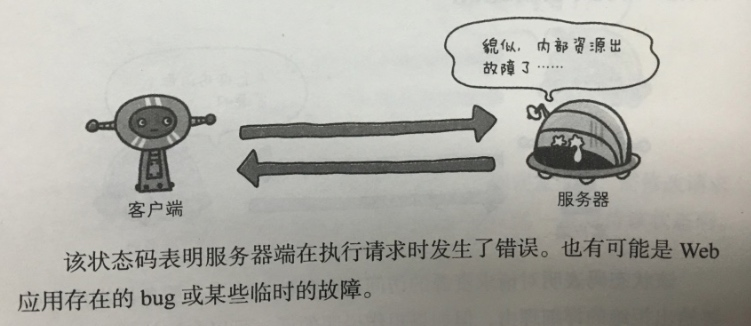

###503 Service Unavailable
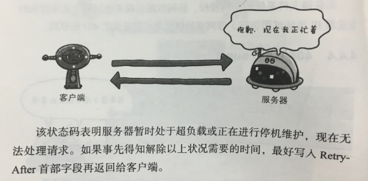

#与HTTP协作的Web服务器

`一台HTTP服务器可以搭建多少Web站点, 但是DNS之后都会转化为服务器的唯一IP地址, 所以发送HTTP请求时, 必须在Host首部内容内完整指定主机名或域名的URI.`

通信数据转发程序.

1. 代理: 一种有转发功能的应用程序, 扮演了位于服务器和客户端"中间人"的角色, 接收由客户端发送的请求并转发给服务器, 同时也接收服务器返回的响应并转发给客户端<p></p>
		- 不改变请求URI<p></p>
		- 级联多台代理服务器时, 需要附加Via首部字段以标记出经过的主机信息<p></p>
		- 可做到针对特定URI访问的控制<p></p>
2. 网关: 转发其他服务器通信数据的服务器, 接收从客户端发送来的请求时, 它就像自己拥有资源的源服务器一样对请求进行处理. 有时客户端可能都不会察觉, 自己的通信目标是一个网关.
3. 隧道: 在相隔甚远的客户端和服务器两者之间进行中转, 并保持双方通信连接的应用程序.

---
1. 代理: 利用缓存技术减少网络带宽的流量, 组织内部针对特定网站的访问控制, 获取访问日志为主要目的, 等等.<p></p>


2. 网关: 
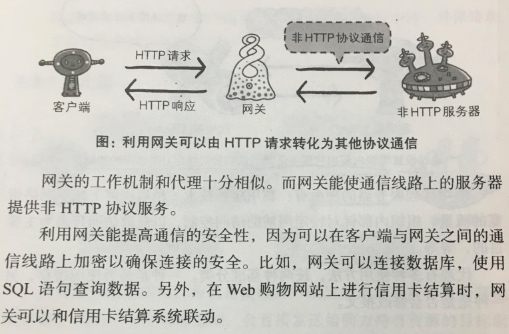
3. 隧道
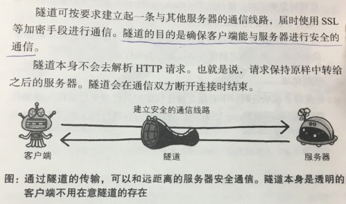

#HTTP首部
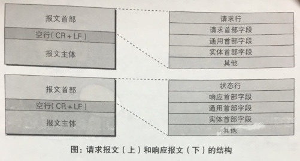


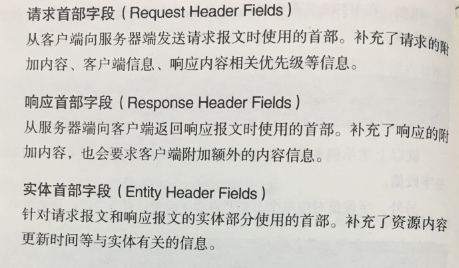

`首部字段名 : 字段值  // 没有引号, ','可以多值 `
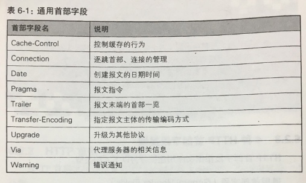

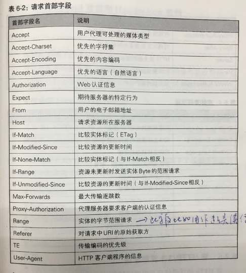
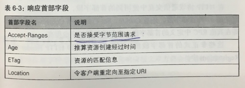
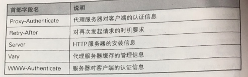


#HTTPS
```
HTTP不足: 
	- 通信使用明文(不加密), 内容可能会被窃听(HTTP本身不具备加密的功能,TCP/IP的工作机制,通信内容在所有的通信线路上都有可能遭到窥视)
	- 不难通信方的身份, 因此有可能遭遇伪装(任何人都可发送请求, 无法阻止DoS攻击(Denial of Service,拒绝服务攻击))
	- 无法证明报文的完整性, 所以有可能已遭遇篡改(MD5,SHA-1等散列值校验,数字签名并不可靠, 因为MD5等本身被篡改的话用户意识不到)
```
###加密对象
- 通信的加密

---
	HTTP协议中没有加密机制, 但可以通过和SSL(Secure Socket Layer,安全套接层)或TLS(Transport Layer Security,安全传输层协议)的组合使用, 加密HTTP的通信内容, SSL还使用了一种被称为证书的手段, 可用于确定方.
	用SSL建立安全通信线路之后, 就可以在这条线路上进行HTTP通信了. 与SSL组合使用的HTTP被称为HTTPS(Http Secure,超文本传输安全协议)或HTTP over SSL.
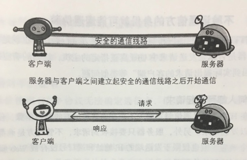

- 内容的加密

---
	客户端需要对HTTP报文进行加密处理后再发送请求.

	

##HTTP + 加密 + 认证 + 完整性保护 = HTTPS
###加密
	SSL采用共享密钥加密和公开密钥加密(Public-key cryptography)的混合加密处理方式.
	TLS: 是以SSL3.0为原型开发的协议
	SSL优缺点: 通信慢和处理速度变慢, 和HTTP相比, 网络负载可能会变慢2到100倍, 没有根本性的解决方案, SSL加速器(专用服务器)来改善
	共享密钥加密: 对称的密钥, 加解密使用同一把密钥(发送文件时要把密钥一同发送)
	公开密钥加密: 使用一对非对称的密钥(公钥,私钥).
	优缺点: 公开密钥处理慢, 加密性强. 但是无法证明公开密钥本身就是货真价实的公开密钥(解决方式:使用由数字证书谁机构和其相关机关颁发的公开密钥证书).
	EV SSL: 证明组织真实性的证书, 证明作为通信一方的服务器是否规范, 可确认对方服务器背后运营的企业是否真实存在.
	客户端证书: 作用同服务器证书
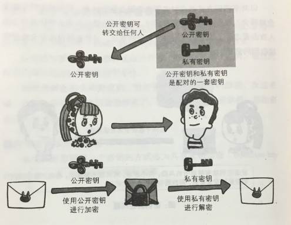
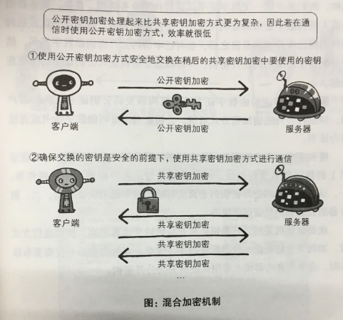
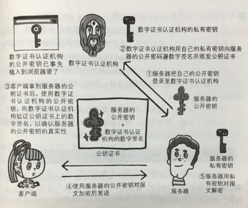
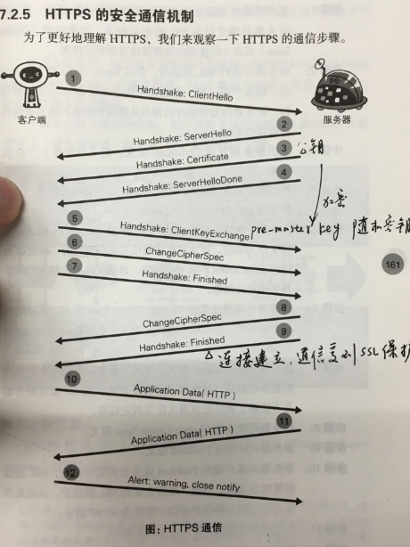

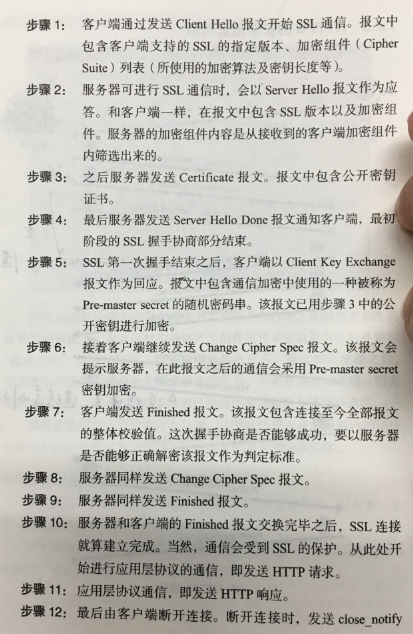

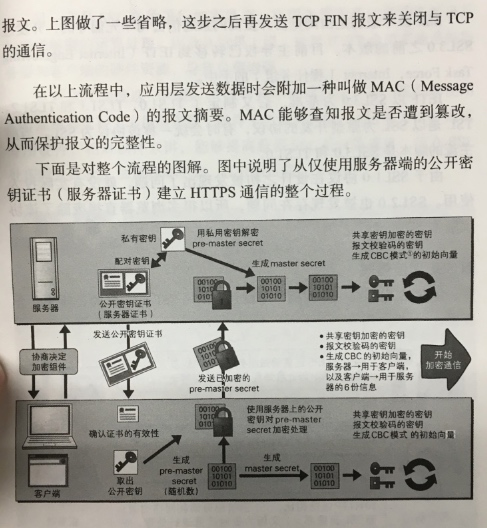


##确认访问用户身份的认证
	核对的信息:
		密码, 动态令牌, 数字证书, 生物认证, IC卡等.
	认证方式:
		BASIC认证(基本认证)
		DIGEST谁(摘要认证)
		SSL客户端认证: 双因素认证(证书,表单)
		FormBase认证(基于表单认证)
		Windows统一认证(Keberos认证, NTLM认证)
		
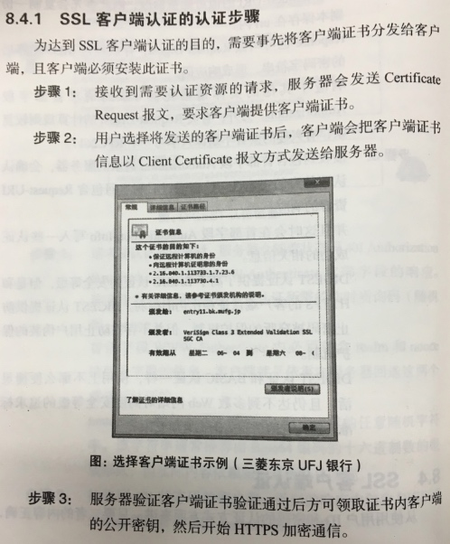


