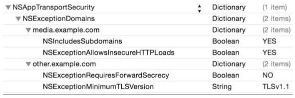
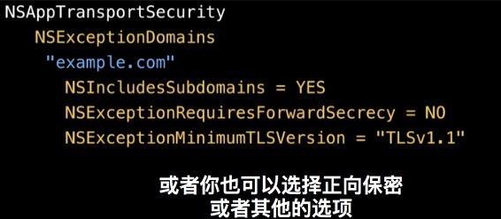
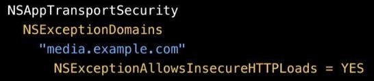
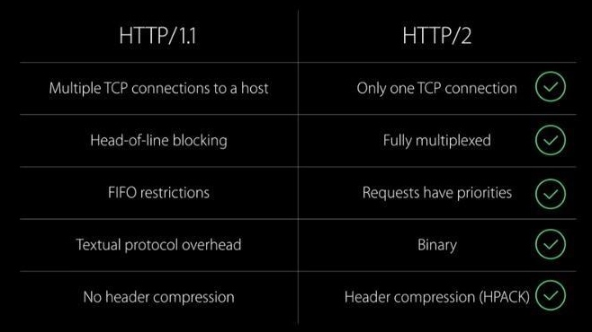

# [WWDC-HTTP 2.0](https://developer.apple.com/videos/play/wwdc2015/711/)
[WWDC-NSURLSession](https://developer.apple.com/videos/play/wwdc2015/711/)
[CocoaChina-NSURLSession](http://www.cocoachina.com/ios/20160202/15211.html)
[NSURLSession](http://www.cocoachina.com/industry/20131106/7304.html)

	HTTPS 是 HTTP 的上一层协议, 属于传输层安全协议, 通过公钥密码学方式, 进行一个多点的信号交换之后, 会创建一个安全的连接
这个连接的安全性基于三个属性
1. 加密
2. 数据完整性
3. 身份验证

**事实上可以通过ATS声明异常原因, 你想使用什么版本的TLS**

**服务器只支持HTTP**
声明哪些域名需要加载HTTP , 仍是明码加载
声明哪些域名需要加载HTTPS, == NO

##HTTP 1.0 2.0 区别
1.0 每一个TCP连接只有一个优先请求(解决: HTTP管道, 或开多个连接)

1. HTTP/2 仅支持一台主机开放一个TCP连接
2. HTTP/2 完全多路复用, 一个新的请求不需要等到服务器对前一个请求回复之后, 但是仍然是按顺序得到的回复, 可以通过优先级改变
3. HTTP/2 有请求优先级, 更多重要的资源可以提供给拥有更高权限的客户端
4. HTTP/2 是一个二进制协议, 使得数据处理和解析速度更快\
5. HTTP/2 使用HPACK, 这是一种更加安全的头压缩机制. HTTP/1 不使用头压缩, 因为安全漏洞的原因, SPDY同样不能使用头压缩. 
HPACK: 分静态和动态HEAD, 可以为同样HEAD的请求节省开销, 当然在第一次请求时是增加开销. HTTP/1.0 重复发一样的HEAD
HTTP/2.0 集成成了 NSURLSession 的API中

##new api
cookie 可以创建一个共享存储区

